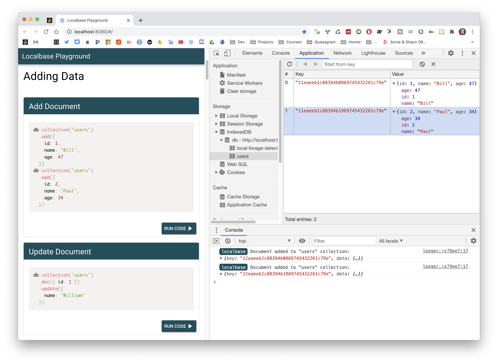

# Localbase Playground

An app for playing around with [Localbase](https://github.com/dannyconnell/localbase) and all the available methods.

*\* Check out the [Localbase Repository](https://github.com/dannyconnell/localbase)*

Localbase Playground contains a bunch of different code snippets (for adding, updating, setting and getting) data to/from a [Localbase](https://github.com/dannyconnell/localbase) database.

You can launch these code snippets (and edit them if you like) in the browser and observe the result in the IndexedDB database and in the console.



## Install Quasar globally (if you don't have it)
```bash
npm install -g @quasar/cli
```

## Install the dependencies
```bash
npm install
```

### Start the app in development mode (hot-code reloading, error reporting, etc.)
```bash
quasar dev
```


### Build the app for production
```bash
quasar build
```